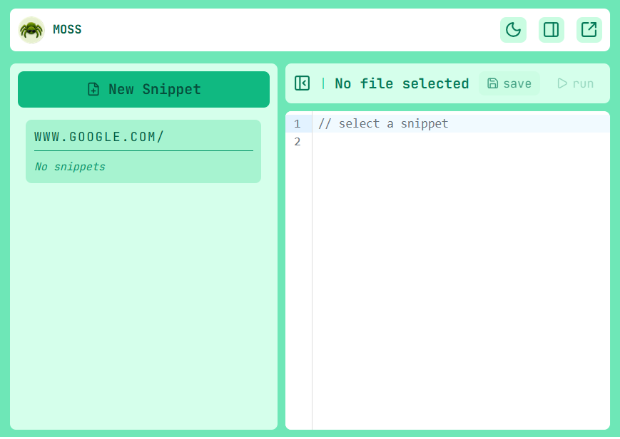
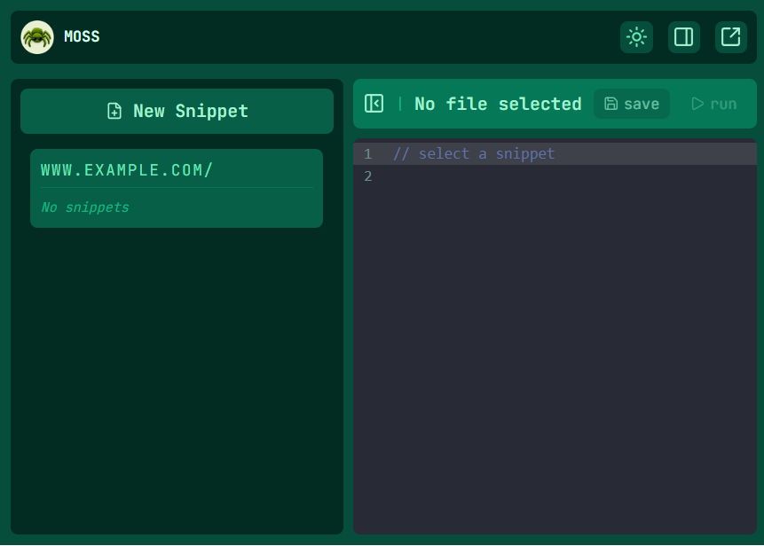
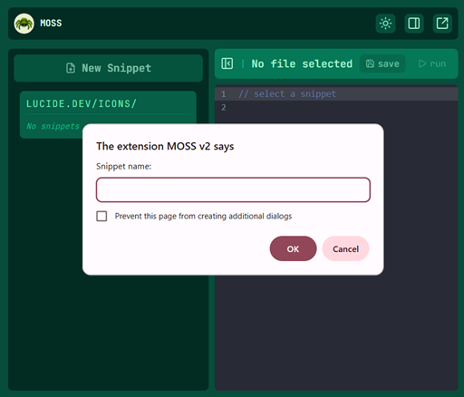
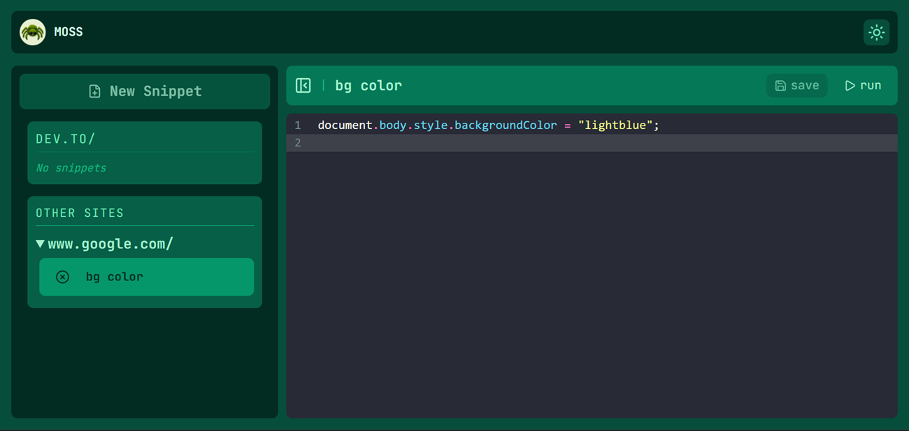
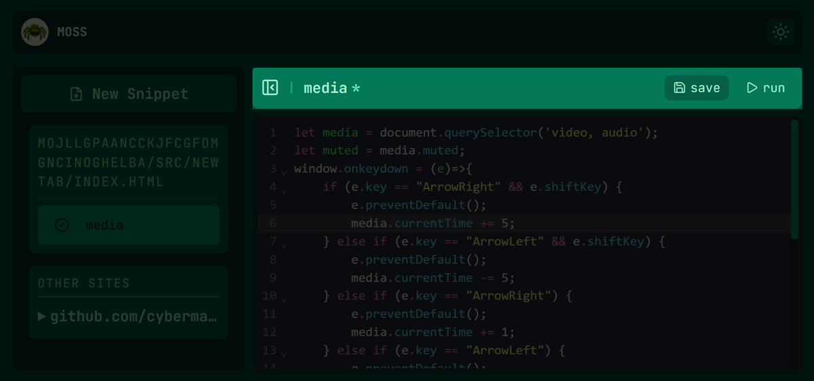
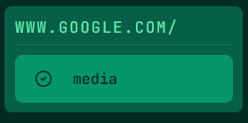

# MOSS — Modular Override Script System


MOSS is a Chrome extension that lets users inject and manage custom JavaScript on any website. Create, edit, enable, and organize scripts directly from the extension popup without opening external pages.

---

## Screenshots

|          Light Mode          |          Dark Mode          |
| :--------------------------: | :-------------------------: |
|  |  |

---

## Features

- **Per-site snippets** — scripts are bound to a hostname/path and only appear when you're on that site
- **Auto-run on load** — toggle the green dot to have a snippet run automatically every time the page loads
- **Manual run** — hit the ▷ run button or `Ctrl+Enter` to execute on demand
- **CSP bypass** — strips `Content-Security-Policy` headers via `declarativeNetRequest` so scripts work on locked-down sites like GitHub and ChatGPT
- **Side panel & new tab modes** — pop MOSS out of the tiny popup into a full side panel or tab
- **Light / dark theme** — persistent toggle in the toolbar
- **No cloud, no account** — everything lives in `chrome.storage.local`

---

## Installation

> MOSS is not on the Chrome Web Store. Load it manually as an unpacked extension.

### Prerequisites

- Node.js 18+
- Chrome 114+

### Build

```bash
git clone https://github.com/your-username/moss.git
cd moss
npm install
npm run build
```

### Load in Chrome

1. Open `chrome://extensions`
2. Enable **Developer mode** (top right toggle)
3. Click **Load unpacked**
4. Select the `dist/` folder

---

## Usage

### Creating a snippet

| Step                                              |             Screenshot             |
| :------------------------------------------------ | :--------------------------------: |
| 1. Click**New Snippet** and give it a name        |   |
| 2. Write your JavaScript in the editor            |  \_ |
| 3. Hit**save** (`Ctrl+S`)                         |     |
| 4. Automate code (run automatically on page load) |         |

### Running a snippet

| Method   | How                                                                          |
| :------- | :--------------------------------------------------------------------------- |
| Manual   | Click ▷**run** or press `Ctrl+Enter`                                         |
| Auto-run | Click the ● dot next to the snippet name to enable — runs on every page load |

### Views

| Icon  | Action                    |
| :---: | :------------------------ |
|  ☰   | Toggle sidebar            |
|   ⊡   | Open in side panel        |
|   ↗   | Open in new tab           |
| ☀ / ☾ | Toggle light / dark theme |

---

## Project Structure

```
moss/
├── public/
│   ├── manifest.json       # Chrome extension manifest (MV3)
│   ├── csp_rules.json      # declarativeNetRequest rules — strips CSP headers
│   └── icons/              # 16px, 48px, 128px extension icons
│
├── src/
│   ├── popup/              # Main UI (700×500px popup)
│   │   ├── App.tsx         # Root — owns theme state
│   │   ├── components/
│   │   │   ├── Toolbar.tsx     # Top bar: branding, theme toggle, view switcher
│   │   │   ├── Container.tsx   # Layout shell, owns script + active state
│   │   │   ├── Sidebar.tsx     # Snippet list, grouped by site
│   │   │   └── EditorArea.tsx  # CodeMirror editor, run/save controls
│   │   ├── index.html
│   │   ├── main.tsx
│   │   └── styles.css
│   │
│   ├── newtab/             # Full-page view (reuses popup App)
│   │   ├── index.html
│   │   └── main.tsx
│   │
│   ├── background/
│   │   └── index.ts        # Service worker — relays RUN_SCRIPT to content script
│   │
│   ├── content/
│   │   └── index.ts        # Injected into every page — blob injection, auto-run
│   │
│   └── shared/
│       ├── types/          # MossScript, MossMessage interfaces
│       ├── hooks/          # useScripts — CRUD + toggle, storage-backed
│       └── utils/          # storage.ts — typed chrome.storage.local wrappers
│
├── vite.config.ts          # Multi-entry build: popup + newtab + background + content
├── tailwind.config.js      # Moss green palette, dark mode via class strategy
└── tsconfig.json
```

---

## How Script Injection Works

MOSS injects scripts through the extension context, allowing custom code to run on many CSP-protected websites without relying on unsafe-eval:

1. Your code is wrapped in a `Blob` with type `application/javascript`
2. A temporary `blob:` URL is created from that blob
3. A `<script src="blob:...">` tag is injected into the page DOM
4. The browser loads it as a legitimate external script — no `eval`, no CSP violation
5. The blob URL is revoked and the script tag is removed after execution

On top of that, MOSS uses `declarativeNetRequest` to strip `Content-Security-Policy` and `Cross-Origin-*` headers from page responses before Chrome enforces them. This is what makes injection work on hardened sites like GitHub and ChatGPT.

> **Note:** Stripping CSP headers removes the site's XSS protection for your browser session while MOSS is active. This is intentional for a personal power tool — just don't publish it to the Web Store without scoping the rules to specific sites.

---

## Tech Stack

| Layer     | Technology                               |
| :-------- | :--------------------------------------- |
| UI        | React 18, TypeScript                     |
| Styling   | Tailwind CSS v3                          |
| Editor    | CodeMirror 6 via `@uiw/react-codemirror` |
| Build     | Vite (multi-entry)                       |
| Extension | Chrome MV3, declarativeNetRequest        |
| Storage   | `chrome.storage.local`                   |

---

## Keyboard Shortcuts

| Shortcut     | Action               |
| :----------- | :------------------- |
| `Ctrl+Enter` | Run current snippet  |
| `Ctrl+S`     | Save current snippet |

---

## License

MIT
